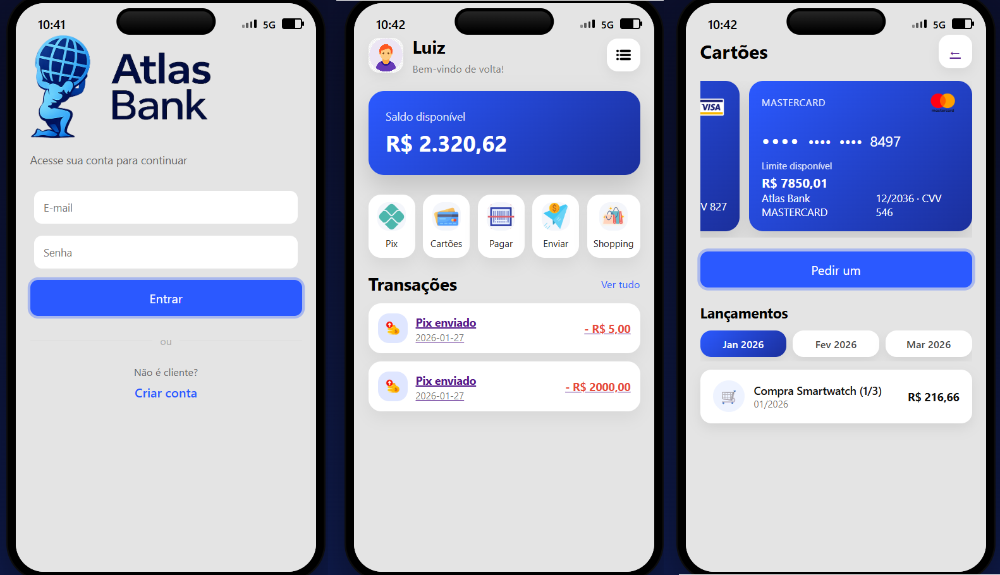

### Integrantes: Rian de Matos Azevedo - 0055942; Breno Luiz de Paula - 0056229

# Atlas-Bank-Banco-de-dados
Sistema bancário web que simula autenticação, Pix, cartões de crédito, faturas e compras parceladas, integrando Flask, SQLite e uma interface mobile interativa.

## 📱 Screenshots



# 🏦 Atlas Bank – Sistema Bancário Web

Simulador de sistema bancário, com foco em **banco de dados**, **lógica financeira**, **operações reais de um banco digital** e **interface web interativa**.

O projeto demonstra conceitos como:
- autenticação de usuários
- controle de saldo
- transferências Pix
- cartões de crédito com faturas mensais
- compras parceladas
- extrato financeiro
- rastreabilidade de transações

---

## 📱 Visão Geral

O Atlas Bank simula a experiência de um **aplicativo bancário mobile**, executado via navegador, com layout inspirado em smartphones.

Cada tela possui uma **apresentação técnica lateral**, explicando:
- consultas SQL executadas
- regras de negócio
- validações financeiras

---

## 🧩 Funcionalidades

### 🔐 Autenticação
- Login e cadastro de usuários
- Controle de sessão com Flask

### 💰 Conta Bancária
- Cálculo dinâmico de saldo
- Histórico de transações
- Entradas e saídas categorizadas

### 💳 Cartões de Crédito
- Múltiplos cartões por usuário
- Limite disponível
- Faturas mensais automáticas
- Compras parceladas distribuídas por mês

### 🔄 Pix
- Pagamento via chave Pix (e-mail)
- Confirmação de destinatário
- Validação de saldo
- Transferência entre contas
- Registro em extrato

### 🛒 Shopping
- Simulação de compras
- Parcelamento em até 12x
- Geração automática de lançamentos futuros

---

## 🗄️ Banco de Dados

O sistema utiliza **SQLite**.

Principais tabelas:
- `usuarios`
- `contas`
- `transferencias`
- `cartoesCredito`
- `faturas`
- `lancamentos`

As operações seguem princípios reais de sistemas bancários:
- atomicidade
- consistência
- integridade referencial
- rastreabilidade

---

## 🧠 Objetivo

Este projeto foi desenvolvido com o objetivo de:
- demonstrar aplicações práticas de banco de dados.
- simular regras reais de instituições financeiras.
- integrar backend e frontend.

---

## 🛠️ Tecnologias Utilizadas

- Python
- Flask
- SQLite
- HTML5
- CSS3
- JavaScript
- Jinja2

---

## 🚀 Como Executar

```bash
# instalar dependências
pip install -r requirements.txt

# criar banco de dados
python init_db.py

# criar usuario com saldo
python criar_usuario.py

# executar aplicação
python app.py
